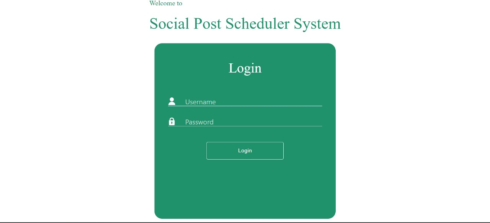

# Welcome to SPSS!



## Introduction

Welcome to the Social Post Scheduler System (SPSS)! It's a tool to help you easily schedule your social media posts ahead of time.. Built using JavaScript (React.js), SPSS empowers users to effortlessly schedule posts across various social media platforms such as LinkedIn and Twitter. With SPSS, users can plan their content ahead of time, ensuring timely and consistent engagement with their audience.

Here is a Live View Demo ( www...........com )


# Key Features:

- **Easy to Use:** SPSS has a simple interface, making it easy for you to navigate and schedule your posts without any hassle.

- **Works with Multiple Platforms:** Whether you're on LinkedIn, Twitter, or other social media sites, SPSS supports them all, giving you the flexibility to manage everything from one place.

- **Schedule with Precision:** Want to post something at a specific time? No problem! SPSS lets you schedule your posts down to the minute, so you can plan ahead with confidence.

- **Manage Your Content:** Create, edit, and organize your posts effortlessly with SPSS. You can add captions, attach photos or videos, and keep everything neatly organized.

- **Handle Multiple Accounts:** If you have several social media accounts, SPSS makes it easy to manage them all in one convenient place.

- **Automation:** Once you've scheduled your posts, SPSS takes care of the rest. No need to manually publish each one – SPSS does it for you automatically.

- **Track Your Performance:** Curious about how your posts are doing? SPSS provides analytics and insights to help you understand your audience better and refine your strategy.

## Benefits:

- **Save Time:** By scheduling your posts in advance, you can free up your time for other tasks. SPSS lets you stay active on social media without spending all day online.

- **Stay Consistent:** Consistency is key to building a strong following. With SPSS, you can maintain a regular posting schedule to keep your audience engaged.

- **Boost Engagement:** By posting at the right times and with the right content, you can increase your visibility and interactions on social media.

## Conclusion:

SPSS is your go-to solution for simplifying social media management. With its user-friendly interface, precise scheduling options, and time-saving automation, SPSS helps you make the most of your online presence. Whether you're a casual user or a social media pro, SPSS has everything you need to succeed.


# Installation Guide

Get started with your React project on GitHub:

1. **Navigate to Project Directory**: Move to the 'my-react-app' directory:

    ```
    cd my-react-app
    ```

2. **Run React Application**: Start the React application 'my-react-app':

    ```
    npm start
    ```

3. **Access Application**: A new browser window will open, showing your React app. If not, go to `localhost:3000` in your browser.


